Customization
=============

#########
Hardening
#########

a. Hardening Dionaea (SMB Service)

Protokol utama yang ditawarkan oleh dionaea adalah SMB. SMB memiliki sejarah untuk bug yang dapat dieksploitasi dari jarak jauh, dan merupakan target yang sangat populer untuk worm. Implementasi SMB menggunakan versi scthon python3 yang diadaptasi. Selain itu serangan yang diketahui pada dionaea SMB mendukung pengunggahan file ke smb share. Hardening layanan SMB pada dionaea dapat menggunakan perintah :

.. code-block:: bash

   $ cd /opt/dionaea/etc/dionaea/services-enabled/
   $ sudo nano smb.yaml

Selanjutnya lakukan konfigurasi pada file smb.yml dengan melakukan uncomment pada beberapa perintah.

Sebelum :

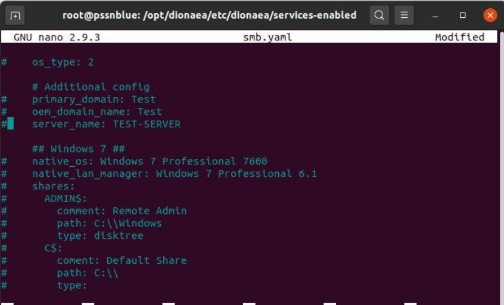

Sesudah :

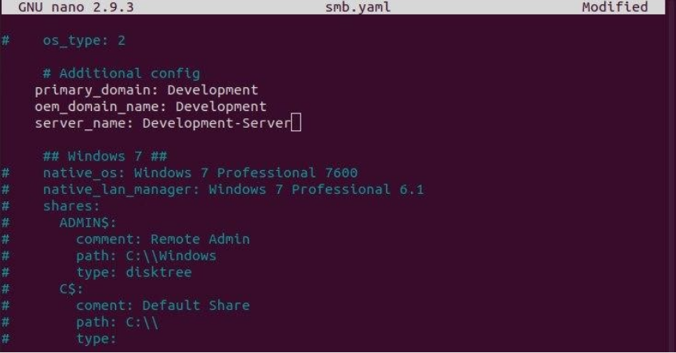

b. Hardening Dionaea (MS-SQL Server)

Microsoft SQL Server adalah sebuah sistem manajemen basis data relasional (RDBMS) produk Microsoft. Bahasa query utamanya adalah Transact-SQL yang merupakan implementasi dari SQL standar ANSI/ISO yang digunakan oleh Microsoft dan Sybase. Umumnya SQL Server digunakan di dunia bisnis yang memiliki basis data berskala kecil sampai dengan menengah, tetapi kemudian berkembang dengan digunakannya SQL Server pada basis data besar. Hardening layanan MS-SQL Server pada dionaea dapat menggunakan perintah :

.. code-block:: bash

   $ cd /opt/dionaea/lib/dionaea/python/dionaea/mssql/
   $ sudo nano mssql.py

Selanjutnya lakukan konfigurasi pada file mssql.py sebagai berikut :

Sebelum :

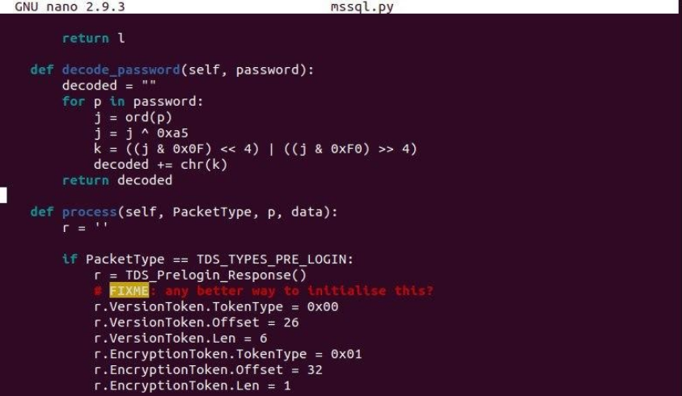

Sesudah :

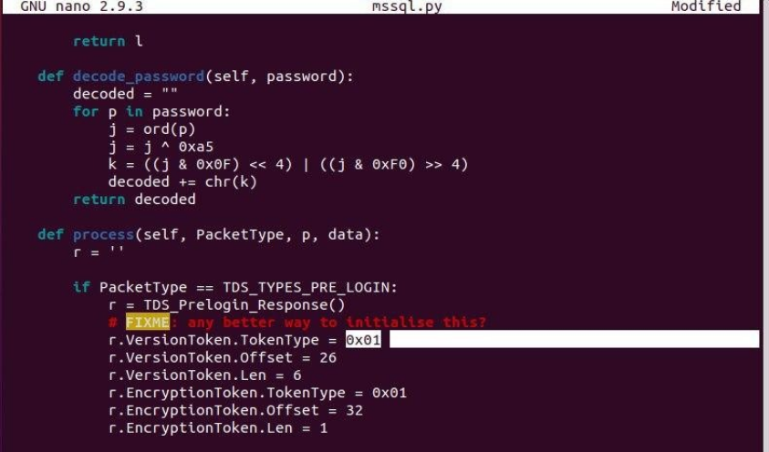

################
Instalasi Cowrie
################

1. Pertama, lakukan update terhadap sistem yang akan digunakan sebagai honeypot. Setelah itu buat user tanpa password dengan nama 'cowrie'.

.. code-block:: bash

   $ apt-get update
   $ adduser --disabled-password cowrie

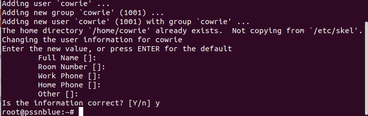

2. Selanjutnya, melakukan instalasi dependecies dan package yang dibutuhkan oleh Cowrie. Diantaranya adalah iptables, python virtual environtment, fake root, authbind, dan git.

.. code-block:: bash

   $ apt install -y iptables iptables-persistent linux-libc-dev make virtualenv python-virtualenv libfakeroot libssl-dev libffi-dev build-essential libpython3-dev python3-minimal authbind git

3. Setelah berhasil melakukan instalasi, selanjutnya masuk sebagai cowrie dan download repositori Cowrie yang ada di GitHub.

.. code-block:: bash

   $ su cowrie
   $ cd /home/cowrie
   $ git clone http://github.com/cowrie/cowrie

4. Setelah berhasil men-download Cowrie, dilanjutkan dengan membuat Python virtual environment. Python virtual environment menyediakan lingkungan yang stabil dan terisolasi untuk python dependecies milik Cowrie. Selanjutnya, menjalankannya dan menginstall persyaratan tambahan menggunakan pip.

.. code-block:: bash

   $ cd cowrie/
   $ virtualenv --python=/usr/bin/python3 cowrie-env
   $ . cowrie-env/bin/activate
   $ pip install --upgrade -r requirements.txt

5. Kemudian, melakukan konfigurasi pada file /bin/cowrie  dengan mengganti dari DAEMONIZE = “ “ menjadi DAEMONIZE=”-n” untuk menonaktifkan daemonisasi saat menggunakan supervisor.

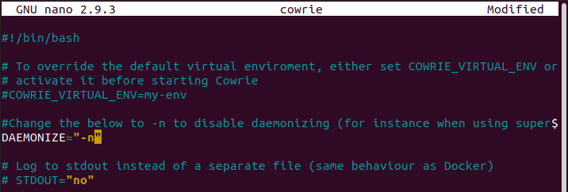

6. Kemudian, melakukan konfigurasi untuk mengubah hostname dari fake root yang dibuat oleh Cowrie pada file “etc/cowrie.cfg.dist”.

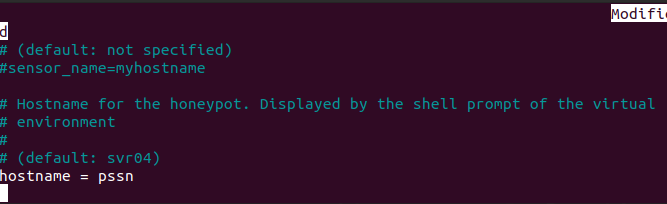

7. Untuk melakukan pengujian terhadap Cowrie dapat dilakukan dengan mengaktifkannya dari user cowrie, namun setelah itu, dipastikan untuk menghentikannya. Cowrie yang berjalan saat login bukan sebagai root, akan membuat root tidak bisa menjalankannya sebagai service. Setelah diaktifkan, dapat diuji dengan mengakses honeypot melalui SSH di port 2222. Hasilnya akan ditunjukkan seperti pada Gambar 10, dimana kami akan login ke fake root  yang dibuat oleh Cowrie.

.. code-block:: bash

   $ bin/cowrie start
   $ bin/cowrie stop

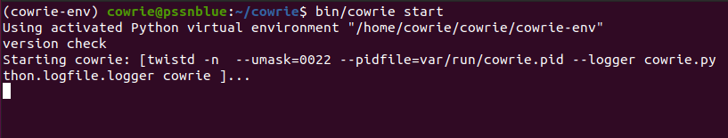

8. Setelah menghentikan Cowrie, kembali ke root shell. Kemudian, membuat file Systemd unit yang bertujuan untuk menjalankan Cowrie sebagai root. Cowrie pun dapat diaktifkan melalui root seperti yang ditunjukkan pada Gambar 12. Berikut isi file nya,

.. code-block:: bash

   # nano /etc/systemd/system/cowrie-honeypot.service

   [Unit]
   Description=Interactive SSH Honeypot
   Wants=network.target
   [Service]
   Type=simple
   User=cowrie
   Group=cowrie
   ExecStart=/home/cowrie/cowrie/bin/cowrie start
   Restart=on-failure
   RestartSec=5
   [Install]
   WantedBy=multi-user.target

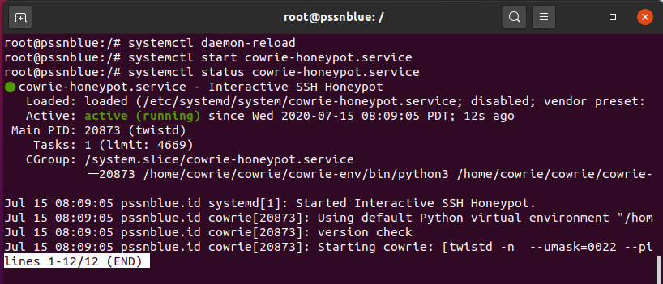

9. Honeypot yang menggunakan port 22 akan mendapatkan lebih banyak serangan dibanding menggunakan port lain, sehingga port asli dari server SSH diganti menjadi port selain 22 dan port yang tidak digunakan oleh layanan lain, disini kami menggunakan port 2233. Setelah itu, melakukan restart terhadap layanan SSH agar konfigurasi baru nya tersimpan.

.. code-block:: bash

   $ echo "Port 2332" >> /etc/ssh/sshd_config
   $ systemctl restart sshd.service

Selanjutnya coba akses server SSH menggunakan port 2233.

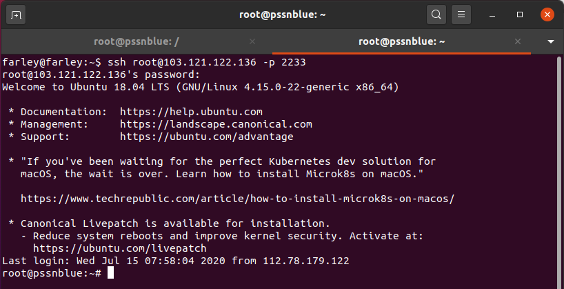

.. code-block:: bash

   # iptables -A PREROUTING -t nat -p tcp --dport 22 -j REDIRECT --to-port 2222
   # iptables-save > /etc/iptables/rules.v4

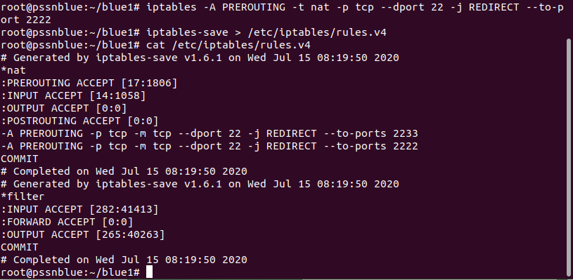

Selanjutnya aktifkan IP forwarding yang terdapat pada file "/etc/sysctl.conf"

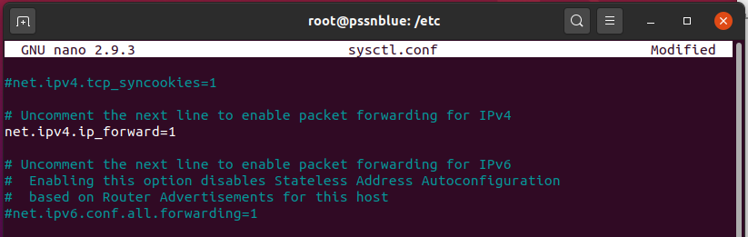

11.  Setelah itu, siapa pun yang mengakses server SSH sebagai root dan menggunakan port 22, secara otomatis akan diteruskan ke port 2222,  fake root yang dibuat oleh Cowrie.

.. image:: ../../images/gambar19.png
   :width: 400
   :align: center

12. Log dapat dilihat pada direktori /home/cowrie/cowrie/var/log/cowrie, terdapat file yang memiliki format log dan json. Format log ditunjukkan pada Gambar 17, sedangkan format json ditunjukkan pada gambar berikut.

Format Log :

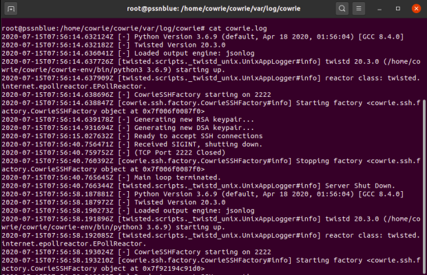

Format json :

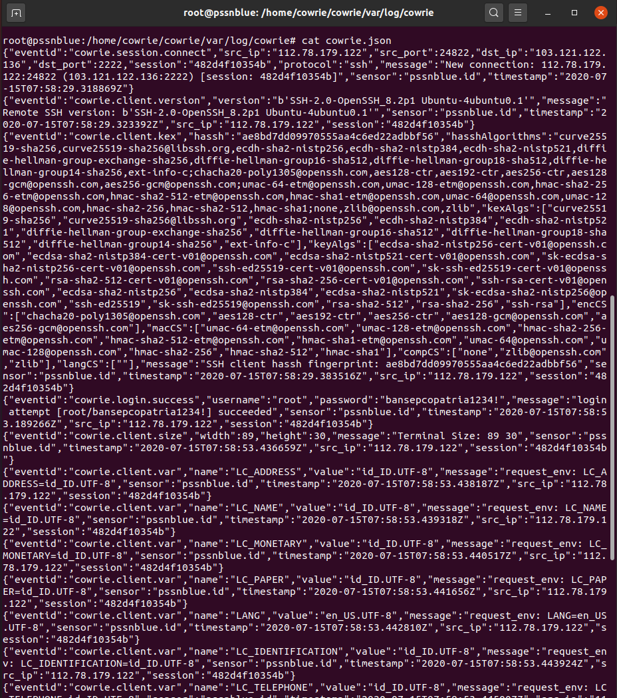
