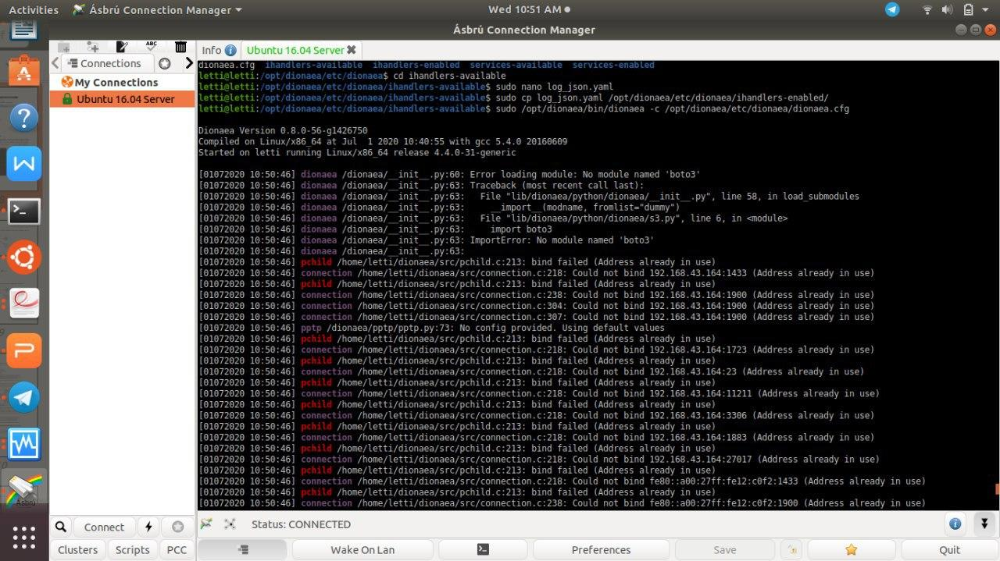

Installation
============

####################
Install Dependencies
####################

Sebelum menginstall dionaea ada beberapa hal yang harus dipersiapkan berikut adalah perintah-perintah yang harus dilakukan dalam menginstall dionaea :

.. code-block:: bash

   $ sudo apt update
   $ sudo apt install git
   $ sudo apt install aptitude
   $ sudo apt install net-tools
   $ sudo apt install sqlite3
   $ git clone https://github.com/DinoTools/dionaea.git
   $ sudo apt install \
   build-essential \
   check cmake \
   cython3 \
   libemu-dev \
   libev-dev \
   libglib2.0-dev \
   libloudmouth1-dev \
   libnetfilter-queue-dev \
   libnl-3-dev \
   libpcap-dev \
   libssl-dev \
   libtool \
   libudns-dev \
   python3 \
   python3-dev \
   python-bson \
   python3-yaml
   $ sudo aptitude -f install libcurl4-openssl-dev

###############
Install Dionaea
###############

Setelah persiapan tersebut sekarang adalah menginstall dionaea.

.. code-block:: bash
   
   $ cd dionaea
   $ mkdir build
   $ cmake -DCMAKE_INSTALL_PREFIX:PATH=/opt/dionaea ..
   $ make
   $ make install

Dengan demikian, dionaea telah berhasil diinstall.
Berikut ialah dokumentasi ketika Dioanea berhasil diinstall pada ubuntu 16.04.

#########################
Update the Dionaea Config
#########################

Setelah menginstall Dionaea sebelum dilanjutkan, kita perlu membuat beberapa perubahan konfigurasi. Dionaea memiliki beberapa masalah dengan IPv6 dan juga cukup bertele-tele dalam log-nya dengan konfigurasi default jadi edit file konfigurasi. Berikut ialah cara untuk mengupdate konfigurasi Dionaea.

.. code-block:: bash

   $ vi /opt/dionaea/etc/dionaea/dionaea.cfg

Kemudian, ubah konfigurasi sebagai berikut, yaitu dengan mengubah variabel yang diinginkan.

.. code-block:: bash

   listen.mode=manual
   listen.addresses=<ip address of the host>

   default.levels=warning,error

   errors.levels=warning,error

########################
Mengidentifikasi Malware
########################

Agar dionaea dapat melakukan deteksi jenis virus dan dapat mengidentifikasinya menggunakan virus total, lakukan pengaturan terlebih dahulu pada bagian virustotal.yaml.

.. code-block:: bash

   $ cd /opt/dionaea/etc/dionaea/ihandlers-avaiable
   $ nano virustotal.yaml

Maka akan muncul tampilan sebagai berikut :

.. code-block:: bash

    -name: virustotal
     config:
       # grab it from your virustotal account at My account -> My API Key (https://www.virustotal.com/en/user/<username>/apikey/)
       apikey: "........."
       file: "@DIONAEA_STATEDIR@/vtcache.sqlite"
       # comment: "This sample was captured in the wild and uploaded by the dionaea honeypot.\n#honeypot #malware #networkworm"

Lakukan perubahan pada isi apikey dengan API key akun virus total yang ingin digunakan. Simpan pengaturan tersebut.

Masuk ke direktori ihandlers-enabled dengan perintah berikut

.. code-block:: bash

   $ cd /opt/dionaea/etc/dionaea/ihandlers-enabled

Salin file virustotal.yaml yang telah diubah sebelumnya dengan perintah :

.. code-block:: bash

   $ ln -s ../ihandlers-available/virustotal.yaml virustotal.yaml

Setelah langkah tersebut dilakukan maka malware yang tertangkap oleh dionaea dapat diidentifikasi dengan melalui virustotal.
