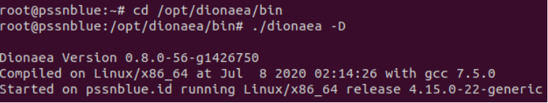
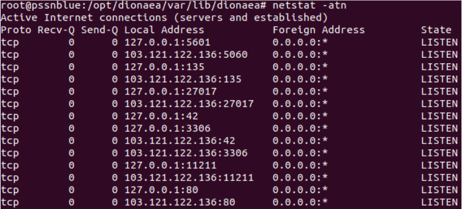
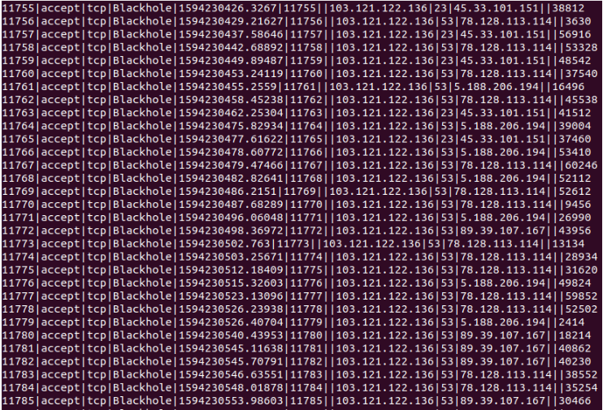
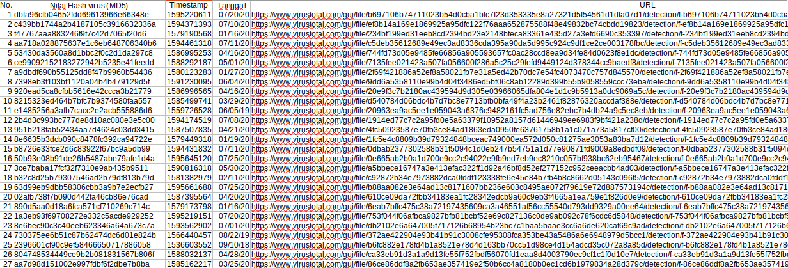
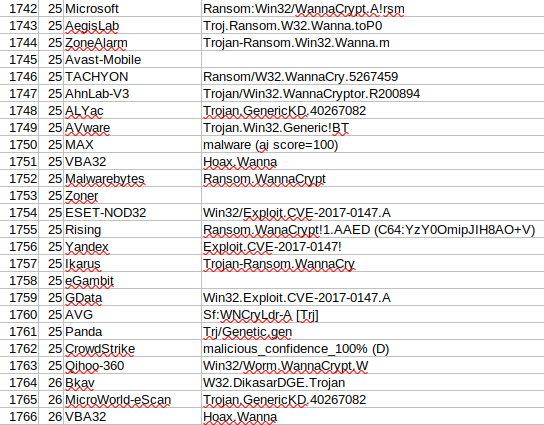
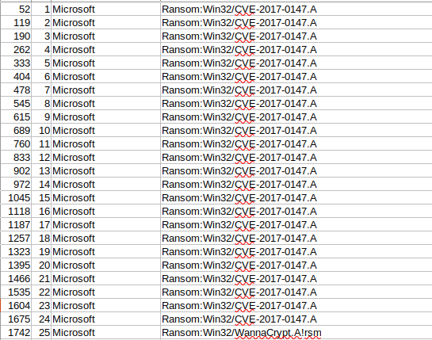

Usage
=====

Dalam penggunaannya, kita akan mencoba menjalankan perintah berikut.

.. code-block:: bash

   $ cd /opt/dionaea/bin
   $ ./dionaea -D

Kita juga bisa melihat status dari koneksi yang ada pada dionaea dengan menggunakan perintah berikut.

.. code-block:: bash

   $ netstat -atn

Kita bisa melihat database dari koneksi yang ada dengan menggunakan perintah berikut.

.. code-block:: bash

   $ cd /opt/dionaea/var/lib/dionaea
   $ sqlite3 dionaea.sqlite
   sqlite > SELECT*FROM connections;

Untuk melihat hasil dari dioanea, unduh file dionaea.sqlite dengan perintah :

.. code-block:: bash

   $ sudo scp -r [usenrame]@[alamat ip server]:/opt/dionaea/var/lib/dionaea/dionaea.sqlite [direktori]/[nama file].sqlite

Buka file tersebut dengan sqlstudio dan ekspor tabel yang dibutuhkan ke dalam format .csv.

Alasan melakukan ekspor tabel yang ada pada sqlitestudio dikarenakan file yang dapat dibaca melaui sqlitestudio hanya 1000 saja. Dengan melakukan ekspor ke format csv maka akan terlihat jumlah asli dari tabel tersebut. 

Berikut adalah contoh hasil virus yang didapat melalui dionaea kelompok 1 per tanggal 29 Juli 2020.

Data diambil dari VirusTotal :

Dari hasil yang diperoleh didapat ada 27 jenis malware yang berbeda yang menginfeksi server dionaea kelompok kami.

Bila melihat data per tanggal 29 Juli 2020 dari tabel virustotalscans, didapati ada 1766 hasil scan malware dari beragam Anti Virus yang ada dari database virustotal.com.

#####################
Hasil scan VirusTotal
#####################

Bila Kita lakukan filter malware apa yang didapati oleh suatu vendor dalam contoh ini adalah Microsoft maka akan didapati hasil sebagai berikut :

####################
Hasil scan Microsoft
####################

Malware berdasarkan Microsoft s.d tanggal 29 Juli 2020 :

1. 24 Malware Ransom:Win32/CVE-2017-0147.A
2. 1 Malware Ransom:Win32/WannaCrypt.A!rsm
